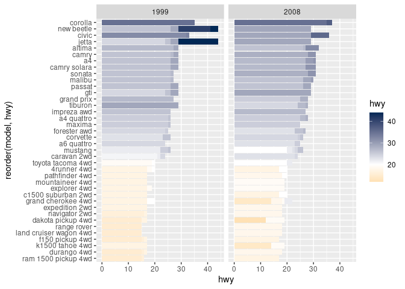

# sds 

R package providing R Markdown templates for SDS

## Install

``` r
# install.packages("devtools")
devtools::install_github("SmithCollege-SDS/sds")
```

## Load

``` r
library(sds)
```

## Get class list

``` r
library(tidyverse)
# download class list from BannerWeb
file <- fs::path("")
docs <- c("~/Dropbox/git/sds192/student_info/s18/ClassList_30661.xls") %>%
  read_banner_course() %>%
  glimpse()
```

## Add Smith theming to a `ggplot`

``` r
library(ggplot2)
ggplot(mpg, aes(y = hwy, x = reorder(model, hwy), fill = hwy)) +
  geom_col(position = "dodge") +
  coord_flip() +
  facet_wrap(~year) +
  scale_fill_smith_cd(midpoint = 20)
```

<!-- -->

## Print hex logo\!

``` r
hex_logo(file = "inst/sds_hex.png")
```

## Write a letter on official SDS letterhead

Select **File -\> New File -\> R Markdown…** and choose the **Smith SDS
Letter** template

-----

Post any bugs to
[Issues](https://github.com/SmithCollege-SDS/sds/issues)\!
